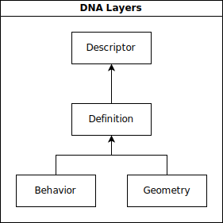

## DNA library

DNA library comes bundled together in this repository as one of the dependencies of DNACalib.
It provides the core functionality of reading and writing MetaHuman DNA files.
It enables the user to query and change the information contained in them.

DNACalib provides a set of useful commands for editing MetaHuman DNA files. Under the hood, it makes use of the DNA library. Some commands just encapsulate a few calls to DNA library, while others contain additional logic.
While users could do all of that on their own using only DNA library, these commands aim to make their lives easier.

## MetaHuman DNA

MetaHuman DNA is a file format which is designed to store the complete description of a 3D object's rig and geometry. 
Relying only on a MetaHuman DNA file, it is possible to reconstruct the complete mesh of an object and have it fully rigged, ready to be animated. In practice, MetaHuman DNA files are used to store only the faces of human characters.

### Layers

Data contained within MetaHuman DNA files is separated into several logical layers. Layers are connected into a loose hierarchy, where each subsequent layer in a MetaHuman DNA file relies on data stored in the layers above it.



It is possible to selectively load a MetaHuman DNA only up to a specified layer. As can be seen in the diagram denoting the organization into layers, the Behavior and Geometry layers are not dependent on each other. This independence is crucial for use cases where the MetaHuman DNA file is needed only to drive a rig (runtime evaluation using the Behavior layer), without the need to access the Geometry data.

#### Descriptor

The Descriptor layer contains basic metadata about the rig, such as:

  - Name of the character
  - Age
  - Facial archetype
  - Arbitrary string metadata in the form of key/value pairs
  - Compatibility parameters as needed (relevant for higher-level systems, e.g. for mixing MetaHuman DNA files)

#### Definition

The Definition layer contains the static data of the rig, such as:

  - Names of controls, joints, blend shapes, animated maps, and meshes
  - Mappings of joints, blend shapes, animated maps, and meshes to individual LODs
  - Joint hierarchy
  - Joint transformations in the bind pose (such as T-pose)

This layer contains necessary information to perform filtering in the subsequent layers based on the chosen LODs.

#### Behavior

The Behavior layer contains the dynamic data of the rig, which is used to:

  - Map GUI controls to raw control values
  - Compute corrective expressions
  - Compute joint transformations
  - Compute blend shape channel weights
  - Compute animated map weights

#### Geometry

The Geometry layer contains all the data needed to reconstruct the mesh of the character, along with its skin weights and blend shape target deltas. The mesh information itself is structured in a format resembling the OBJ format.

### API overview

When working with MetaHuman DNA files, two main interfaces used are:
- [`BinaryStreamReader`](/dnacalib/DNACalib/include/dna/BinaryStreamReader.h)
- [`BinaryStreamWriter`](/dnacalib/DNACalib/include/dna/BinaryStreamWriter.h)

They are used to read data from or write data to a binary stream. For example, a [`FileStream`](/dnacalib/DNACalib/include/trio/streams/FileStream.h) is used when working with files.

Here, we will present a few code snippets that show basic usage of the library.
A general API overview of the DNA library can be found [here](/docs/dna_api.md).

As with DNACalib, DNA library is written in C++, but there is a Python wrapper for it, so it can be used both from C++ and Python.

#### Creating a reader/writer

##### Reader

An example of a function reading a binary DNA from file:

```
def load_dna(path):
    stream = FileStream(path, FileStream.AccessMode_Read, FileStream.OpenMode_Binary)
    reader = BinaryStreamReader(stream, DataLayer_All)
    reader.read()
    if not Status.isOk():
        status = Status.get()
        raise RuntimeError(f"Error loading DNA: {status.message}")
    return reader
```

When creating a reader, besides the stream parameter, you can also specify the data layer which you wish to load. In this example, all layers will be loaded, because ```DataLayer_All``` is used, but you can specify any of the following:
```
DataLayer_Descriptor
DataLayer_Definition - includes Descriptor and Definition
DataLayer_Behavior - includes Descriptor, Definition, and Behavior
DataLayer_Geometry - includes Descriptor, Definition, and Geometry
DataLayer_GeometryWithoutBlendShapes - includes Descriptor, Definition, and Geometry without blend shapes
DataLayer_AllWithoutBlendShapes - includes everything except blend shapes from Geometry
DataLayer_All
```

For example, if you want to load only the behavior layer (including definition and descriptor), use:

```
stream = FileStream(path, FileStream.AccessMode_Read, FileStream.OpenMode_Binary)
reader = BinaryStreamReader(stream, DataLayer_Behavior)
reader.read()
if not Status.isOk():
    status = Status.get()
    raise RuntimeError(f"Error loading DNA: {status.message}")
```

##### Writer

An example of a function writing a binary DNA from file:

```
def save_dna(reader, path):
    stream = FileStream(path, FileStream.AccessMode_Write, FileStream.OpenMode_Binary)
    writer = BinaryStreamWriter(stream)
    # Create a writer based on the reader using all data layers (if no argument is passed to setFrom(), DataLayer_All is the default value)
    writer.setFrom(reader)
    # For example, to create a writer with only Geometry layer (including Definition and Descriptor), use:
    # writer.setFrom(reader, DataLayer_Geometry)

    writer.write()

    if not Status.isOk():
        status = Status.get()
        raise RuntimeError(f"Error saving DNA: {status.message}")
```
Beside specifying layers when creating a reader, layers to use can be specified when creating a writer as well (as an argument to ```setFrom()``` method).

The ```load_dna``` and ```save_dna``` functions are utilized in the majority of [`examples`](/examples/).

**Note**: There are also [`JSONStreamReader`](/dnacalib/DNACalib/include/dna/JSONStreamReader.h) and [`JSONStreamWriter`](/dnacalib/DNACalib/include/dna/JSONStreamWriter.h) which are used when MetaHuman DNA file is written in JSON format, instead of binary. It should be noted however, that JSON variant is only intended to be used e.g. as a tool for debugging. Unlike binary reader and writer, their JSON counterparts cannot perform filtering and generally produce much larger files.
The recommended format for storing DNA files is binary.

**Known issue**: Reading a JSON MetaHuman DNA file currently fails. This issue will be resolved in a future release.

#### Examples

Here are a few example snippets of using the library.

##### Example 1: Read neutral vertex positions for specified mesh

```
dna = load_dna(input_path)

if dna.getMeshCount() == 0:
    print("No meshes found in DNA.")
    return

mesh_index = 0
xs = dna.getVertexPositionXs(mesh_index)
ys = dna.getVertexPositionYs(mesh_index)
zs = dna.getVertexPositionZs(mesh_index)
```

##### Example 2: Read neutral joint coordinates and joint orient values

```
dna = load_dna(input_path)

# Read joint coordinates
neutral_joint_translation_xs = dna.getNeutralJointTranslationXs()
neutral_joint_translation_ys = dna.getNeutralJointTranslationYs()
neutral_joint_translation_zs = dna.getNeutralJointTranslationZs()

# Read joint orientations
neutral_joint_orient_xs = dna.getNeutralJointRotationXs()
neutral_joint_orient_ys = dna.getNeutralJointRotationYs()
neutral_joint_orient_zs = dna.getNeutralJointRotationZs()
```

##### Example 3: Read blend shape target deltas for an expression and change them

```
def read_blend_shape_target_deltas(reader, mesh_index, blend_shape_target_index):
    """
    Read blend shape target deltas and corresponding vertex indices.
    """

    vertex_indices = reader.getBlendShapeTargetVertexIndices(
        mesh_index, blend_shape_target_index
    )
    blend_shape_target_delta_count = reader.getBlendShapeTargetDeltaCount(
        mesh_index, blend_shape_target_index
    )
    deltas = []
    for delta_index in range(blend_shape_target_delta_count):
        x, y, z = reader.getBlendShapeTargetDelta(
            mesh_index, blend_shape_target_index, delta_index
        )
        deltas.append([x, y, z])
    return vertex_indices, deltas

# Read and then change blend shape target deltas for expression "jaw_open", mesh "head_lod0_mesh"
input_dna = load_dna(input_path)

mesh_name = "head_lod0_mesh"
mesh_count = input_dna.getMeshCount()
head_mesh_index = 0
for mesh_index in range(mesh_count):
    if input_dna.getMeshName(mesh_index) == mesh_name:
        head_mesh_index = mesh_index
        break

bs_target_count = input_dna.getBlendShapeTargetCount(head_mesh_index)
expr_name = "jaw_open"

# Get the blend shape target index for the specified expression
for i in range(bs_target_count):
    bs_channel_index = input_dna.getBlendShapeChannelIndex(head_mesh_index, i)
    bs_name = input_dna.getBlendShapeChannelName(bs_channel_index)
    if bs_name == expr_name:
        bs_target_index = i
        break

vertex_indices, deltas = read_blend_shape_target_deltas(input_dna, head_mesh_index, bs_target_index)

# Modify deltas (in this case, just add 1.0 to each delta)
for i in range(len(deltas)):
    deltas[i][0] += 1.0
    deltas[i][1] += 1.0
    deltas[i][2] += 1.0

# Create a writer DNA from input DNA
output_stream = dna.FileStream(outputPath, dna.FileStream.AccessMode_Write, dna.FileStream.OpenMode_Binary)

# In this example, for debugging purposes, write a DNA in JSON format, to quickly see if blend shape deltas have been changed
output_dna = dna.JSONStreamWriter(output_stream)
output_dna.setFrom(input_dna)

# Write new blend shape delta values for expression
output_dna.setBlendShapeTargetDeltas(mesh_index, bs_target_index, deltas)

# If you modified deltas in a way that e.g. removed or added some,
# then you would also have to set new vertex indices that correspond to new deltas:
# output_dna.setBlendShapeTargetVertexIndices(mesh_index, bs_target_index, new_vertex_indices)

# Write DNA with modified values
output_dna.write()

if not dna.Status.isOk():
    status = dna.Status.get()
    raise RuntimeError("Error saving DNA: {}".format(status.message))
```

### Usage

There are short [`examples`](/examples) that cover some of the cases users may encounter when working with MetaHuman DNAs.
Some of those are:
  - [`writing the contents of a MetaHuman DNA file to JSON format for inspection`](/examples/dna_binary_to_json_demo.py)
  - [`clearing all blend shape data from the DNA`](/examples/dnacalib_clear_blend_shapes.py)
  - [`removing certain LODs from the DNA`](/examples/dnacalib_lod_demo.py)
