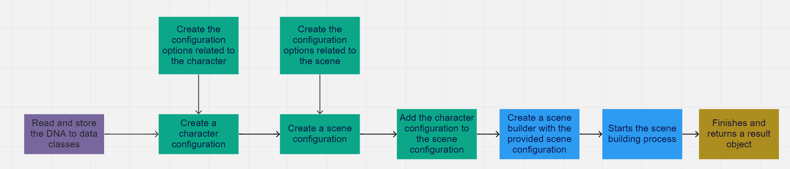
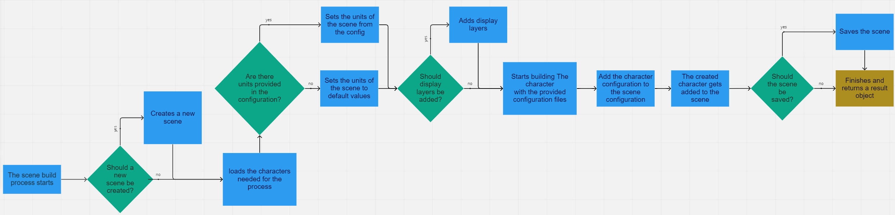

# DNAViewer
The [`dna_viewer`](/dna_viewer) contains all the needed classes for reading and creating a functional rig in Maya from the DNA file.
It is organized in a way that allows every option to be configurable, so you can easily get the exact result you want.

## Examples
- [Generates rig and export FBX per LOD](/examples/dna_viewer_demo.py)
- [Propagate changes from Maya scene to dna](/examples/dna_viewer_grab_changes_from_scene_and_propagate_to_dna.py)
- [Simple UI](/examples/dna_viewer_run_in_maya.py)

## Usage from code
There are two [APIs](docs/dna_viewer_api.md):
  - [assemble](docs/dna_viewer_api_rig_assembly.md)
  - [mesh](docs/dna_viewer_api_mesh_utilities.md)

The usage of these can be found in the [dna_viewer_demo.py](/examples/dna_viewer_demo.py).

## Usage in Maya 
Usage in Maya is explained [here](dna_viewer_maya.md)

## Folder structure

- [builder](/dna_viewer/builder) - Contains the builder classes, which are used for easily adding configuration options
and building the scene, character, meshes, etc.
- [config](/dna_viewer/config) - Contains classes that represent configuration options. These files are used for fine-tuning the options.
- [const](/dna_viewer/const) - Contains constants files used in the project.
- [model](/dna_viewer/model) - Contains the data classes used in the project.
- [reader](/dna_viewer/reader) - Contains the classes that are used for reading the contents of the DNA file.
- [ui](/dna_viewer/ui) - Contains the classes needed for the Maya UI.
- [util](/dna_viewer/util) - Mostly contains the classes that are wrapper classes around Maya method calls.

## How it works

The general flow is the following:

The flow of the scene building process is the following:

The flow of the rig building process is the following:

Legend:
- blue: builder-related.
- green: config-related.
- brown: model-related.
- purple: reader-related.
