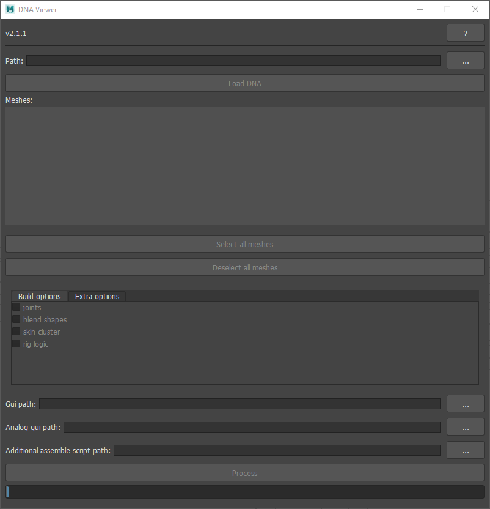

# Usage in Maya 
There is also a [Maya UI Window](/examples/dna_viewer_run_in_maya.py) which can be used for creating the scene with
creating a functional rig in a non-programmatic manner.

During scene generation, the RigLogic4 plugin will be loaded automatically and you can expect to get the following message:

Click `Allow` to load the plugin. If you enable the  **Apply to all plugins in this location** option,
Maya will not show this notification anymore.